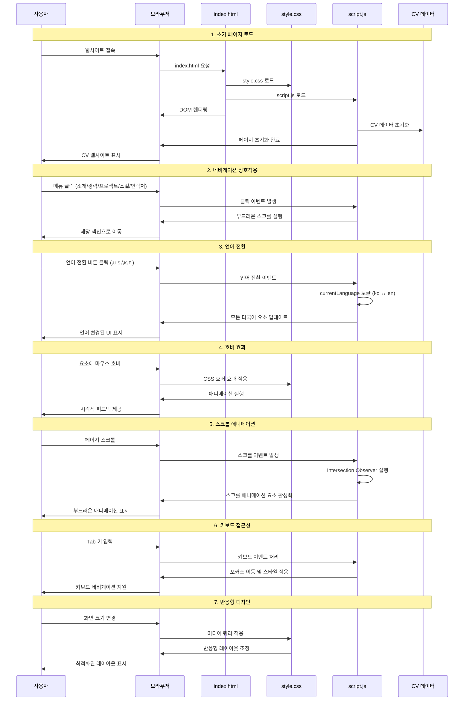

# CV Web App

Modern, Simple, Sleek한 소프트웨어 엔지니어의 CV 웹 애플리케이션입니다.

## 📋 프로젝트 개요

이 프로젝트는 순수 HTML, CSS, JavaScript만을 사용하여 구현된 반응형 CV 웹사이트입니다. 한글/영어 다국어 지원과 현대적인 디자인을 특징으로 합니다.

## ✨ 주요 기능

- **원페이지 디자인**: 모든 정보가 하나의 페이지에 구성
- **다국어 지원**: 한글/영어 언어 전환 기능 (국기 이모티콘 사용)
- **반응형 디자인**: 모바일, 태블릿, 데스크톱 모든 기기 지원
- **부드러운 애니메이션**: 스크롤 및 호버 효과
- **접근성 고려**: 키보드 네비게이션 및 스크린 리더 지원
- **JSON 기반 데이터**: CV 정보를 JSON으로 관리

## 🛠️ 기술 스택

- **HTML5**: 시맨틱 마크업
- **CSS3**: Flexbox, Grid, 애니메이션
- **JavaScript (ES6+)**: 모듈화된 코드 구조
- **Noto Sans KR**: 한글 폰트 최적화

## 📁 프로젝트 구조

```
cv-web-app/
├── index.html          # 메인 HTML 파일
├── style.css           # 스타일시트
├── script.js           # JavaScript 로직
├── profile.png         # 프로필 사진
└── README.md           # 프로젝트 문서
```

## 🔄 웹앱 동작 방식

다음은 CV Web App의 주요 사용자 인터랙션과 시스템 동작을 보여주는 시퀀스 다이어그램입니다:



## 🚀 시작하기

### 설치 및 실행

1. **저장소 클론**
   ```bash
   git clone [repository-url]
   cd cv-web-app
   ```

2. **웹 서버 실행**
   ```bash
   # Python 3 사용
   python -m http.server 8000
   
   # 또는 Node.js 사용
   npx http-server
   
   # 또는 Live Server 확장 프로그램 사용 (VS Code)
   ```

3. **브라우저에서 확인**
   ```
   http://localhost:8000
   ```

### 직접 실행

`index.html` 파일을 브라우저에서 직접 열어도 실행됩니다.

## 📱 반응형 디자인

- **데스크톱**: 1200px 이상
- **태블릿**: 768px - 1199px
- **모바일**: 767px 이하

## 🌐 다국어 지원

- **한국어 (기본)**: 완전한 한국어 지원
- **영어**: 모든 텍스트의 영어 번역 제공
- **언어 전환**: 우상단 국기 이모티콘 버튼으로 실시간 전환
  - 🇰🇷 (한국어 모드) ↔ 🇺🇸 (영어 모드)

## 🎨 디자인 특징

- **색상 팔레트**: 연회색 계열의 깔끔한 디자인
- **타이포그래피**: Noto Sans KR 폰트 사용
- **애니메이션**: 부드러운 스크롤 및 호버 효과
- **레이아웃**: 모던한 그리드 시스템
- **국기 이모티콘**: 직관적인 언어 전환 UI

## 📊 CV 섹션 구성

1. **소개 (About)**: 프로필 사진과 간단한 소개
2. **경력 (Experience)**: 타임라인 형태의 경력 정보
3. **프로젝트 (Projects)**: 주요 프로젝트 포트폴리오
4. **스킬 (Skills)**: 기술 스택 카테고리별 정리
5. **연락처 (Contact)**: 연락 정보 및 소셜 링크

## 🔧 커스터마이징

### CV 데이터 수정

`script.js` 파일의 `cvData` 객체를 수정하여 개인 정보를 변경할 수 있습니다:

```javascript
const cvData = {
    experience: [
        {
            date: "2022 - 현재",
            title: "시니어 풀스택 개발자",
            company: "회사명",
            description: "업무 설명"
        }
        // ... 더 많은 경력 정보
    ],
    projects: [
        {
            title: "프로젝트명",
            description: "프로젝트 설명",
            technologies: ["React", "Node.js"],
            demoUrl: "https://demo-url.com",
            githubUrl: "https://github-url.com"
        }
        // ... 더 많은 프로젝트
    ],
    skills: {
        frontend: ["React", "Vue.js", "TypeScript"],
        backend: ["Node.js", "Python", "MongoDB"],
        tools: ["Git", "Docker", "AWS"]
    }
};
```

### 스타일 수정

`style.css` 파일에서 색상, 폰트, 레이아웃을 수정할 수 있습니다:

```css
/* 색상 변경 */
:root {
    --primary-color: #6c757d;
    --background-color: #f8f9fa;
    --text-color: #495057;
}

/* 폰트 변경 */
body {
    font-family: 'Your-Font', sans-serif;
}
```

### 다국어 텍스트 추가

HTML 요소에 `data-ko`와 `data-en` 속성을 추가하여 다국어 지원을 확장할 수 있습니다:

```html
<h1 data-ko="한국어 텍스트" data-en="English Text">한국어 텍스트</h1>
```

## 🧪 테스트

프로젝트에는 포괄적인 테스트 케이스가 포함되어 있습니다:

- **기능 테스트**: 모든 기능의 정상 작동 확인
- **반응형 테스트**: 다양한 화면 크기에서의 레이아웃 확인
- **접근성 테스트**: 키보드 네비게이션 및 스크린 리더 지원
- **브라우저 호환성**: Chrome, Firefox, Safari, Edge 테스트

자세한 테스트 정보는 `project_tests.md` 파일을 참조하세요.

## 📋 요구사항 충족

이 프로젝트는 다음 요구사항을 모두 충족합니다:

- ✅ 순수 HTML/CSS/JavaScript 구현
- ✅ 3개 파일 구조 (index.html, style.css, script.js)
- ✅ 원페이지 구성
- ✅ 앵커 스크롤 네비게이션
- ✅ JSON 기반 CV 데이터
- ✅ 한글/영어 다국어 지원 (국기 이모티콘 UI)
- ✅ Noto Sans KR 폰트 사용
- ✅ 연회색 계열 Light Mode
- ✅ 반응형 디자인
- ✅ 접근성 고려

## 🚀 성능 최적화

- **이미지 최적화**: WebP 형식 지원
- **폰트 최적화**: Google Fonts preconnect 사용
- **스크롤 최적화**: 디바운스 함수로 성능 향상
- **애니메이션 최적화**: CSS transform 사용

## 🔒 보안 고려사항

- **XSS 방지**: innerHTML 대신 textContent 사용
- **외부 링크**: rel="noopener noreferrer" 속성 추가
- **이미지 오류 처리**: 기본 이미지 fallback 제공

## 📄 라이선스

이 프로젝트는 MIT 라이선스 하에 배포됩니다.

## 🤝 기여하기

1. Fork the Project
2. Create your Feature Branch (`git checkout -b feature/AmazingFeature`)
3. Commit your Changes (`git commit -m 'Add some AmazingFeature'`)
4. Push to the Branch (`git push origin feature/AmazingFeature`)
5. Open a Pull Request

## 📞 연락처

프로젝트에 대한 문의사항이 있으시면 언제든 연락주세요:

- **이메일**: kim.developer@example.com
- **GitHub**: [@kimdeveloper](https://github.com/kimdeveloper)

---

**Made with ❤️ by Kim Developer**